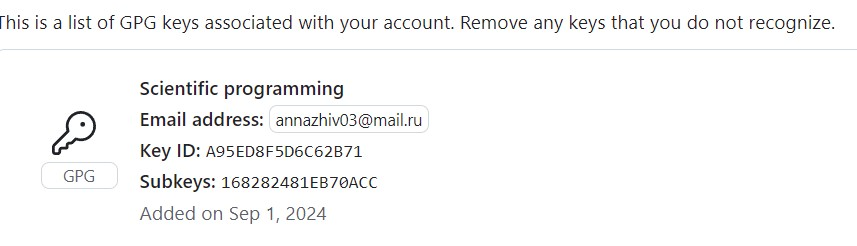
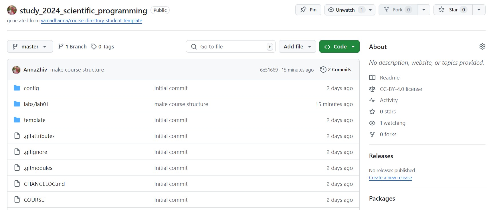

---
## Front matter
lang: ru-RU
title: Презентация по лабораторной работе №1
subtitle: Дисциплина "Научное программирование"
author:
  - Живцова А.А.
institute:
  - Кафедра теории вероятностей и кибербезопасности, Российский университет дружбы народов имени Патриса Лумумбы, Москва, Россия
date: 05 сентября 2024

## i18n babel
babel-lang: russian
babel-otherlangs: english

## Formatting pdf
toc: false
toc-title: Содержание
slide_level: 2
aspectratio: 169
section-titles: true
theme: metropolis
header-includes:
 - \metroset{progressbar=frametitle,sectionpage=progressbar,numbering=fraction}
---

# Информация

## Докладчик

:::::::::::::: {.columns align=center}
::: {.column width="70%"}

  * Живцова Анна Александровна
  * студент кафедры теории вероятностей и кибербезопасности
  * Российский университет дружбы народов имени Патриса Лумумбы
  * [zhivtsova_aa@pfur.ru](mailto:zhivtsova_aa@pfur.ru)
  * <https://github.com/AnnaZhiv>

:::
::: {.column width="30%"}


:::
::::::::::::::

# Вводная часть

## Актуальность

В настоящее время любые крупные проекты реализуются командой из нескольких человек, что делает необходимым использование систем контроля версий. Использование таких систем позволяет    
- наладить непрерывную интеграцию и развертывание ПО (CI/CD)     
- фиксировать все изменения в проекте, структурируя версии в древовидной структуре    
- сохранять вспомогательные подписи для каждой новой версии     
- сохранять все версии и при необходимости вернуться к нужному состоянию     

## Объект и предмет исследования

- Система контроля версий Git    
- Веб-ресурс gitgub    
- Команды для управления и конфигурации git и github    
- Протоколы удаленного доступа SSH и PGP      

## Цели

- Изучить идеологию и применение средств контроля версий.    
- Освоить умения по работе с git.    
- Настроить базовую конфигурацию для работы с git.    

## Задачи

- Создать базовую конфигурацию для работы с git.    
- Создать ключ SSH.    
- Создать ключ PGP.    
- Настроить подписи git.    
- Зарегистрироваться на Github.    
- Создать локальный каталог для выполнения заданий по предмету.    

## Материалы и методы

- Система контроля версий Git    
- Веб-ресурс gitgub    
- Протоколы удаленного доступа SSH и PGP    

# Выполнение работы

## Базовая настройка git

Установка имени 

``` git config --global user.name "Name Surname"     
git config --global user.email "work@mail"     
git config --global core.quotepath false     
git config --global init.defaultBranch master    
git config --global core.autocrlf input ```

## Создание ключей SSH и PGP

Сздание ключей SSH 

``` ssh-keygen -t rsa -b 4096; ssh-keygen -t ed25519  ```

Создание ключа PGP 

``` gpg --full-generate-key ``` 

Параметры ключа PGP

– тип RSA and RSA;
– размер 4096;
– срок действия не истекает никогда.

##  Настройка автоматических подписей коммитов git

```git config --global user.signingkey <PGP Fingerprint>    
git config --global commit.gpgsign true    
git config --global gpg.program $(which gpg2)    
```

## Сознание репозитория курса на основе шаблона

``` gh repo create study_2034_sc_pr --template=yamadharma/course-directory-student-template --public    
git clone --recursive git@github.com:AnnaZhiv/study_2034_sc_pr.git sc_pr ```

# Результаты

## Подключение к Github через PGP

{#fig:006 width=90%}

## Готовый настроенный репозиторий

{#fig:009 width=70%}

``` git add .    
git commit    
git push    
```


