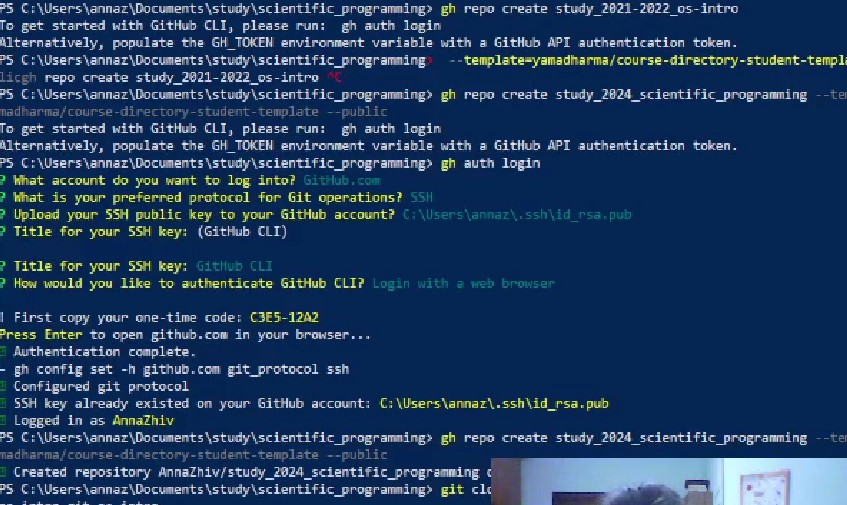

---
## Front matter
title: "Отчёт по лабораторной работе"
subtitle: "Дисциплна: Научное программирование"
author: "Живцова Анна, 1132249547"

## Generic otions
lang: ru-RU
toc-title: "Содержание"

## Bibliography
bibliography: bib/cite.bib
csl: pandoc/csl/gost-r-7-0-5-2008-numeric.csl

## Pdf output format
toc: true # Table of contents
toc-depth: 2
lof: true # List of figures
lot: true # List of tables
fontsize: 12pt
linestretch: 1.5
papersize: a4
documentclass: scrreprt
## I18n polyglossia
polyglossia-lang:
  name: russian
  options:
	- spelling=modern
	- babelshorthands=true
polyglossia-otherlangs:
  name: english
## I18n babel
babel-lang: russian
babel-otherlangs: english
## Fonts
mainfont: IBM Plex Serif
romanfont: IBM Plex Serif
sansfont: IBM Plex Sans
monofont: IBM Plex Mono
mathfont: STIX Two Math
mainfontoptions: Ligatures=Common,Ligatures=TeX,Scale=0.94
romanfontoptions: Ligatures=Common,Ligatures=TeX,Scale=0.94
sansfontoptions: Ligatures=Common,Ligatures=TeX,Scale=MatchLowercase,Scale=0.94
monofontoptions: Scale=MatchLowercase,Scale=0.94,FakeStretch=0.9
mathfontoptions:
## Biblatex
biblatex: true
biblio-style: "gost-numeric"
biblatexoptions:
  - parentracker=true
  - backend=biber
  - hyperref=auto
  - language=auto
  - autolang=other*
  - citestyle=gost-numeric
## Pandoc-crossref LaTeX customization
figureTitle: "Рис."
tableTitle: "Таблица"
listingTitle: "Листинг"
lofTitle: "Список иллюстраций"
lotTitle: "Список таблиц"
lolTitle: "Листинги"
## Misc options
indent: true
header-includes:
  - \usepackage{indentfirst}
  - \usepackage{float} # keep figures where there are in the text
  - \floatplacement{figure}{H} # keep figures where there are in the text
---

# Цель работы

- Изучить идеологию и применение средств контроля версий.    
- Освоить умения по работе с git.    
- Настроить базовую конфигурацию для работы с git.    

# Задание

- Создать базовую конфигурацию для работы с git.    
- Создать ключ SSH.    
- Создать ключ PGP.    
- Настроить подписи git.    
- Зарегистрироваться на Github.    
- Создать локальный каталог для выполнения заданий по предмету.    

# Теоретическое введение

## Git

Git -- распределённая система управления версиями. 

Github -- крупнейший веб-сервис для хостинга IT-проектов и их совместной разработки. Веб-сервис основан на системе контроля версий Git.

В ходе работы были использованы следующие команды для конфигурации git:

Установка имени 

``` git config --global user.name "Name Surname" ```

Установка адреса электронной почты  

``` git config --global user.email "work@mail" ```

Настройка utf-8 в выводе сообщений git  

``` git config --global core.quotepath false ```

Задание имени начальной ветки 

``` git config --global init.defaultBranch master ```

Установка параметра autocrlf 

``` git config --global core.autocrlf input ```

Немного о параметре autocrlf. Параметр "core.autocrlf" придумали для обеспечения работы над одним проектом программистов из разных операционных систем. Предполагается, что программист в операционной системе «Windows» будет работать с файлами, в которых окончания строк только вида CRLF. При этом предполагается, что он включит для проекта настройку "core.autocrlf" со значением "true". Тогда он будет работать в своей папке проекта с файлами, в которых окончания строк будут вида CRLF, при этом в базе данных "Git" эти же файлы будут сохранены с окончаниями вида LF. Программист в операционной системе "Windows" этого даже не заметит, ведь конвертация происходит автоматически.

В тот же момент программист в Unix-подобной операционной системе будет работать с той же базой данных "Git", но у него для проекта будет включена настройка «core.autocrlf» со значением "input" (или со значением "false"). Он будет получать из базы данных файлы с окончаниями строк вида LF, как и принято в Unix-подобных операционных системах.

Установка параметра safecrlf

 ``` git config --global core.safecrlf warn ```

Если core.safecrlf установлен на "true" или "warm", Git проверяет, если преобразование является обратимым для текущей настройки core.autocrlf.
core.safecrlf true - отвержение необратимого преобразования lf<->crlf. Полезно, когда специфические бинарники похожие на текстовые файлы.
core.safecrlf warn - печать только предупреждение, но принимает необратимый переход.

Установка параметра commit.gpgsign для автоматической подписи коммитов gpg ключем 

``` git config --global user.signingkey [PGP Fingerprint]; git config --global commit.gpgsign true ``` 

Более подробно про систему Git [@chacon2014pro],

## SSH PGP

SSH (от англ. Secure Shell) — криптографический сетевой протокол, предназначенный для удалённого доступа к операционной системе и осуществления безопасного удалённого управления в рамках незащищённой сети (например, через интернет).

SSH обеспечивает защищённый канал связи между клиентом и сервером, через который можно:

-- передавать данные (почтовые, видео, файлы);    
-- работать в командной строке;    
-- удалённо запускать программы, в том числе графические.   

PGP (англ. Pretty Good Privacy) — компьютерная программа, также библиотека функций, позволяющая выполнять операции шифрования и цифровой подписи сообщений, файлов и другой информации, представленной в электронном виде, в том числе прозрачное шифрование данных на запоминающих устройствах, например, на жёстком диске.

Шифрование PGP осуществляется последовательно хешированием, сжатием данных, шифрованием с симметричным ключом, и, наконец, шифрованием с открытым ключом, причём каждый этап может осуществляться одним из нескольких поддерживаемых алгоритмов. Симметричное шифрование производится с использованием одного из семи симметричных алгоритмов (AES, CAST5, 3DES, IDEA, Twofish, Blowfish, Camellia) на сеансовом ключе. Сеансовый ключ генерируется с использованием криптографически стойкого генератора псевдослучайных чисел. Сеансовый ключ зашифровывается открытым ключом получателя с использованием алгоритмов RSA или Elgamal (в зависимости от типа ключа получателя). Каждый открытый ключ соответствует имени пользователя или адресу электронной почты. Первая версия системы называлась Сеть доверия и противопоставлялась системе X.509, использовавшей иерархический подход, основанной на удостоверяющих центрах, добавленный в PGP позже. Современные версии PGP включают оба способа.

# Выполнение лабораторной работы

1. Настройка github. Я работе я использовала свою учетную запись  ([AnnaZhiv](https://github.com/AnnaZhiv)) на [github](https://github.com)  (см рис. [-@fig:001]).

{#fig:001 width=90%}

2. Установка программ. К счастью, основное программное обеспечение (git, gh) также было установлено на моем компьютере (см рис. [-@fig:002]).

{#fig:002 width=90%}

3. Базовая настройка git. Для базовой настройки git  использовала команды, приведенные на рисунке [-@fig:003]. Объяснение выолненных команд содержится в теоретической части отчета.

{#fig:003 width=90%}

4. Ключи ssh. Ключи ssh были созданы (см рис. [-@fig:004]), но не использовались.

{#fig:004 width=90%}

5. Ключ PGP. Создала ключ PGP (см рис. [-@fig:005]) с рекомендованными параметрами и использовала его для подключения к github (см рис. [-@fig:006], [-@fig:008]).

{#fig:005 width=90%}

{#fig:006 width=90%}

{#fig:008 width=90%}

6. Настройка рабочего прстранства. Следуя инструкциям я получила репозиторий для ведения лабораторных работ. 

{#fig:007 width=90%}

{#fig:009 width=90%}

# Выводы

В данной работе мне удалось освежить в памяти основы использования системы контроля версий git и изучить несколько новых команд. В частности использовать PGP ключ для подключения к github. В итоге выполнения лабораторной работы я получила рабочее пространство для выполнения лабораторных работ по дисциплине "научное программирование". 

# Список литературы

::: {#refs}
:::
