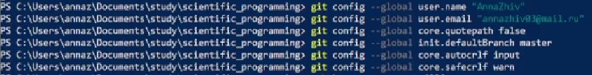

---
## Front matter
title: "Отчёт по лабораторной работе"
subtitle: "Дисциплна: Научное программирование"
author: "Живцова Анна, 1132249547"

## Generic otions
lang: ru-RU
toc-title: "Содержание"

## Bibliography
bibliography: bib/cite.bib
csl: pandoc/csl/gost-r-7-0-5-2008-numeric.csl

## Pdf output format
toc: true # Table of contents
toc-depth: 2
lof: true # List of figures
lot: true # List of tables
fontsize: 12pt
linestretch: 1.5
papersize: a4
documentclass: scrreprt
## I18n polyglossia
polyglossia-lang:
  name: russian
  options:
	- spelling=modern
	- babelshorthands=true
polyglossia-otherlangs:
  name: english
## I18n babel
babel-lang: russian
babel-otherlangs: english
## Fonts
mainfont: IBM Plex Serif
romanfont: IBM Plex Serif
sansfont: IBM Plex Sans
monofont: IBM Plex Mono
mathfont: STIX Two Math
mainfontoptions: Ligatures=Common,Ligatures=TeX,Scale=0.94
romanfontoptions: Ligatures=Common,Ligatures=TeX,Scale=0.94
sansfontoptions: Ligatures=Common,Ligatures=TeX,Scale=MatchLowercase,Scale=0.94
monofontoptions: Scale=MatchLowercase,Scale=0.94,FakeStretch=0.9
mathfontoptions:
## Biblatex
biblatex: true
biblio-style: "gost-numeric"
biblatexoptions:
  - parentracker=true
  - backend=biber
  - hyperref=auto
  - language=auto
  - autolang=other*
  - citestyle=gost-numeric
## Pandoc-crossref LaTeX customization
figureTitle: "Рис."
tableTitle: "Таблица"
listingTitle: "Листинг"
lofTitle: "Список иллюстраций"
lotTitle: "Список таблиц"
lolTitle: "Листинги"
## Misc options
indent: true
header-includes:
  - \usepackage{indentfirst}
  - \usepackage{float} # keep figures where there are in the text
  - \floatplacement{figure}{H} # keep figures where there are in the text
---

# Цель работы

-- Изучить идеологию и применение средств контроля версий.    
-- Освоить умения по работе с git.    
-- Настроить базовую конфигурацию для работы с git.    

# Задание

-- Создать базовую конфигурацию для работы с git.
-- Создать ключ SSH.
-- Создать ключ PGP.
-- Настроить подписи git.
-- Зарегистрироваться на Github.
-- Создать локальный каталог для выполнения заданий по предмету.

# Теоретическое введение

# Выполнение лабораторной работы

Описываются проведённые действия, в качестве иллюстрации даётся ссылка на иллюстрацию (рис. [-@fig:001]).

{#fig:001 width=70%}

1. Настройка github. Я работе я использовала свю учетную запись ([AnnaZhiv](https://github.com/AnnaZhiv)) на [github](https://github.com) (см рис. [-@fig:001]).

{#fig:001 width=90%}

2. Установка программ. К счастью, основное программное обеспечение (git, gh) также было установлено на моем компьютере (см рис. [-@fig:002]).

{#fig:002 width=90%}

3. Базовая настройка git. Для базовой настройки git  использовала команды, приведенные на рисунке [-@fig:003]. Объяснение выолненных команд содержится в теоретической части отчета.

{#fig:003 width=90%}

4. Ключи ssh. Ключи ssh были созданы (см рис. [-@fig:004]), но не использовались.

{#fig:004 width=90%}

5. Ключ PGP. Создала ключ PGP (см рис. [-@fig:005]) с рекомендованными параметрами и использовала его для подключения к github (см рис. [-@fig:006], [-@fig:008]).

{#fig:005 width=90%}

{#fig:006 width=90%}

{#fig:008 width=90%}

# Выводы

Здесь кратко описываются итоги проделанной работы.

# Список литературы{.unnumbered}

::: {#refs}
:::
