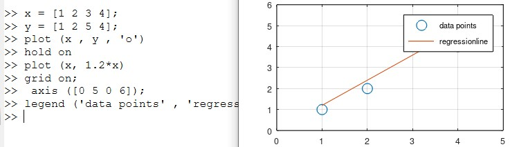
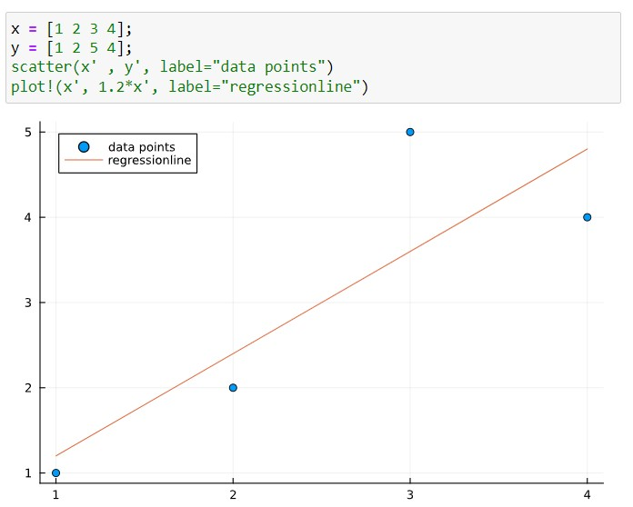
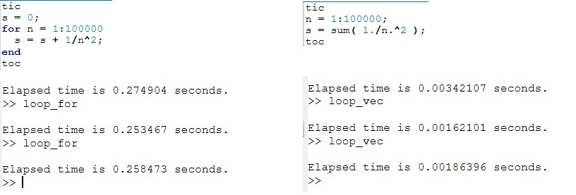
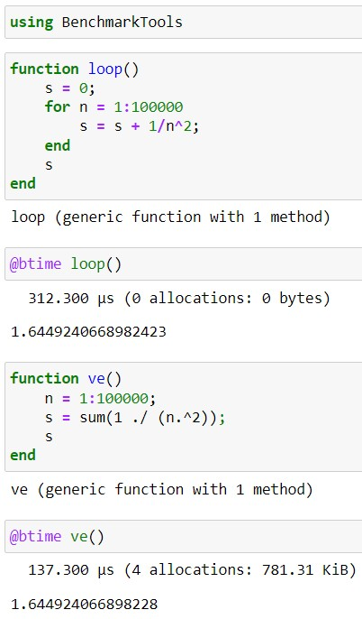

---
## Front matter
lang: ru-RU
title: Презентация по лабораторной работе №3
subtitle: Дисциплина "Научное программирование"
author:
  - Живцова А.А.
institute:
  - Кафедра теории вероятностей и кибербезопасности, Российский университет дружбы народов имени Патриса Лумумбы, Москва, Россия
date: 05 сентября 2024

## i18n babel
babel-lang: russian
babel-otherlangs: english

## Formatting pdf
toc: false
toc-title: Содержание
slide_level: 2
aspectratio: 169
section-titles: true
theme: metropolis
header-includes:
 - \metroset{progressbar=frametitle,sectionpage=progressbar,numbering=fraction}
---

# Информация

## Докладчик

:::::::::::::: {.columns align=center}
::: {.column width="70%"}

  * Живцова Анна Александровна
  * студент кафедры теории вероятностей и кибербезопасности
  * Российский университет дружбы народов имени Патриса Лумумбы
  * [zhivtsova_aa@pfur.ru](mailto:zhivtsova_aa@pfur.ru)
  * <https://github.com/AnnaZhiv>

:::
::: {.column width="30%"}


:::
::::::::::::::

# Вводная часть

## Актуальность

Сложность современных математических задач и необходимость в быстром получении результата мотивируют использовать средства компьютерной алгебры и специализированные языки научного программирования в проведении исследований. Среди средств, автоматизирующих проведение математических операций, выделяется открытое программное обеспечение Octave. Исследователи из Университета Мэриленда в США провели сравнительный анализ математических вычислений, используя MATLAB, Octave, SciLab и FreeMat в простом сценарии и в сложном. В первом случае решали систему линейных уравнений а в втором — конечно-разностную дискретизацию уравнения Пуассона в двухмерном пространстве. Основной вывод — GNU Octave справляется с задачами лучше остальных открытых математических пакетов, демонстрируя результат сопоставимый с матлабовским. 

## Объект и предмет исследования

- Язык научного программирования Octave    
- Среда программирования GNUoctave    
- Язык научного программирования Julia     
- Среда программирования Jupyter notebook     
- Вектора, матрицы, операции линейной алгебры и графики    

## Цели

- Изучить основы языков научного программирования Octave и Julia    
- Выполнить практические примеры для закрепления синтаксиса    
- Проверить эффективность векторных вычислений  

## Задачи

- Изучить типы переменных
- Выполнить примеры операций из линейной алгебры
- Освоить процедуру рисования графиков
- На примере сравнить скорость выполнения программ, записанных через цикл и векторные операции   

## Материалы и методы

- Язык научного программирования Octave    
- Среда программирования GNUoctave   
- Язык научного программирования Julia     
- Среда программирования Jupyter notebook     

# Выполнение работы

## Типы данных и операции

Проведена работа с переменными типа вектор-строка, вектор-столбец, матрица.    
Выполнены арифметические операции:    
- сложение,    
- вычитание,    
- умножение,     
- возведение в степень.    

## Типы данных и операции (2)

А также операции линейной алгебры: 
- сложение векторов,     
- умножения на скаляр,     
- скалярное умножение,    
- векторное умножение,    
- матричное умножение,    
- трансппонирование,    
- сложениие матриц,    
- обращение матриц ```inv(A)```.    

Операции нахождения
- проекции вектора на вектор,     
- норму вектора ```norm(u)```,     
- определитель матрицы ```det(A)```,     
- ранг матрицы ```rank(A)```,     
- собственные значения матрицы ```eig(A)``` или ```eigvals(A)```.

## Рисование графиков 

Освоила функцию рисования графиков ```plot``` с возможными аргументами цвета и толщины линий. А также способы настройки внешнего вида графиков:        
- подпись осей ```xlabel ('x'), ylabel ('x')```,     
- совмещение нескольких графиков на одном рисунке ```hold on```,     
- установка легенды ```legend ('')```,     
- сетки ```grid on```,     
- названия рисунка ```title ('')```,     
- диапазона осей ```axis([])```.    

## Поэлемеентные операции 

Используя поэлементные операции с векторами, проверила скорость выполнения программы при использовании цикла и поэлементных операций в векторах. 

# Результаты

## Поиск проекции вектора на вктор 

``` >> u = [3 5];    
>>  v = [7 2];    
>> proj = dot(u, v)/(norm(v))^2 * v    
proj =  4.0943   1.1698 
```

## График с настроенным внешним видом Octave

{#fig:006 width=90%}

## График с настроенным внешним видом Julia

{#fig:016 width=70%}

## Время выполнения программ, записанных в разной форме Octave

{#fig:008 width=90%}

## Время выполнения программ, записанных в разной форме Octave

{#fig:018 width=90%}

# Выводы

В данной работе я познакомилась с языками научного программирования Octave и Julia.  Изучила некоторые типы данных, арифметические операции, а также операции линейной алгебры. Освоила процедуру рисования и настройки внешнего вида графиков. На примере сравнила скорость выполнения программ, записанных через цикл и векторные операции. Поэлементные операции с векторами показывают лучшую производительность. 


