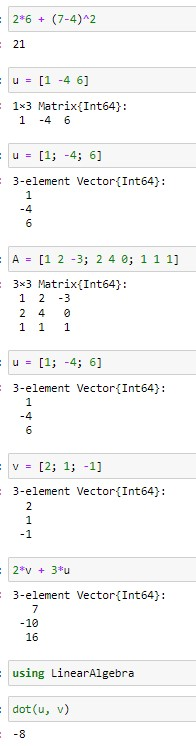
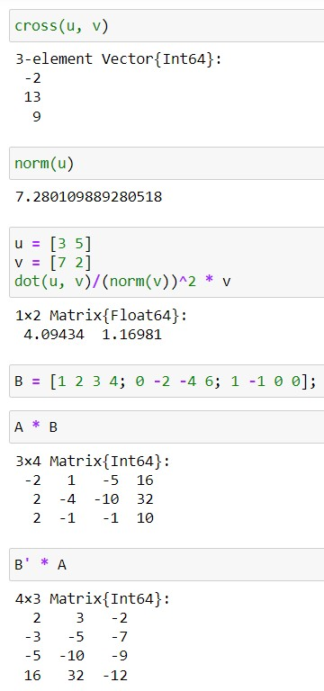
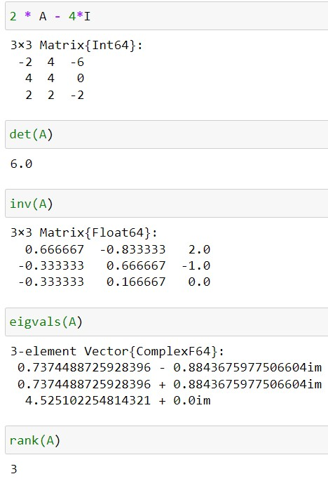
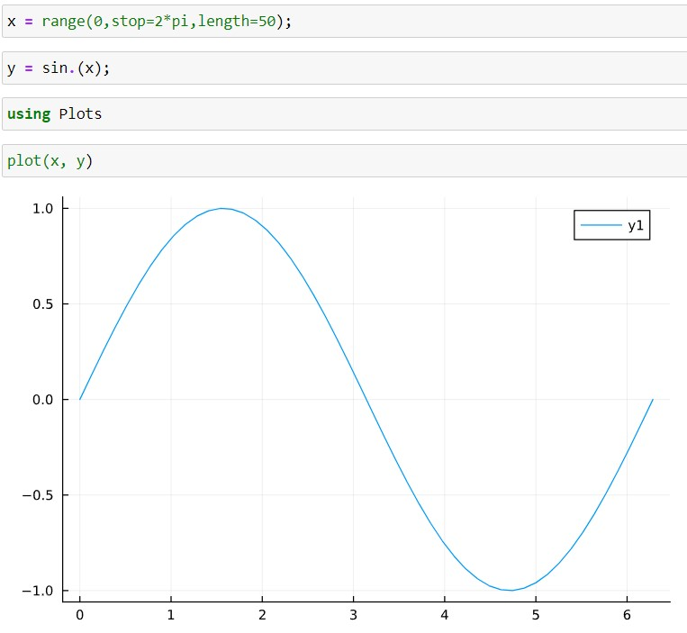
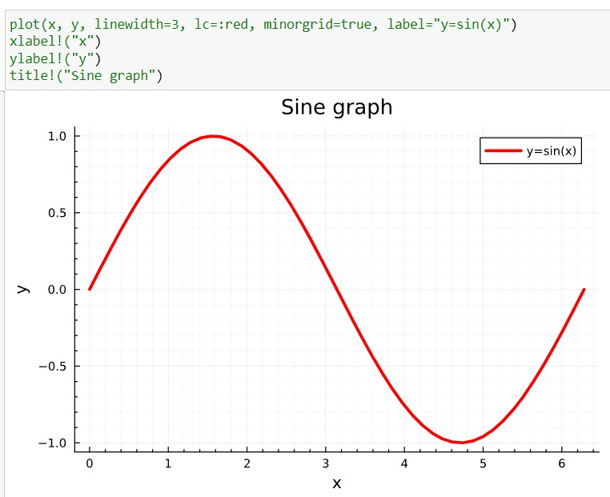
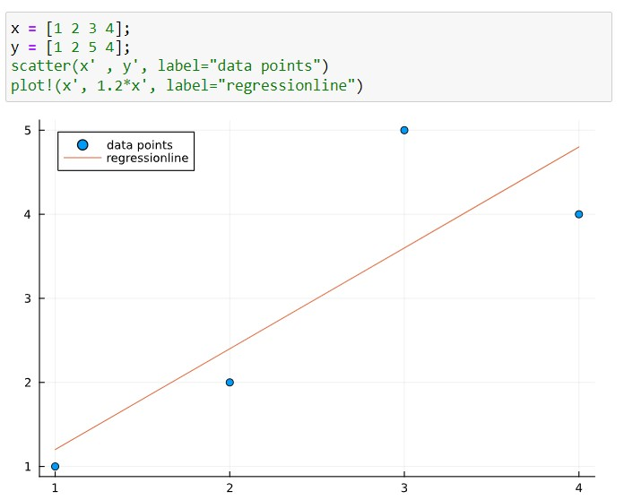
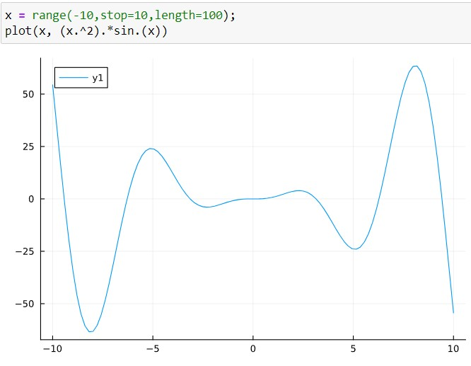
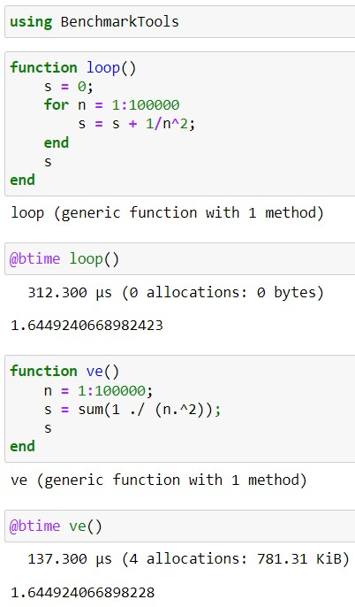

---
## Front matter
title: "Отчёт по лабораторной работе №3"
subtitle: "Дисциплна: Научное программирование"
author: "Живцова Анна, 1132249547"

## Generic otions
lang: ru-RU
toc-title: "Содержание"

## Bibliography
bibliography: cite.bib
csl: pandoc/csl/gost-r-7-0-5-2008-numeric.csl

## Pdf output format
toc: true # Table of contents
toc-depth: 2
lof: true # List of figures
lot: true # List of tables
fontsize: 12pt
linestretch: 1.5
papersize: a4
documentclass: scrreprt
## I18n polyglossia
polyglossia-lang:
  name: russian
  options:
	- spelling=modern
	- babelshorthands=true
polyglossia-otherlangs:
  name: english
## I18n babel
babel-lang: russian
babel-otherlangs: english
## Fonts
mainfont: IBM Plex Serif
romanfont: IBM Plex Serif
sansfont: IBM Plex Sans
monofont: IBM Plex Mono
mathfont: STIX Two Math
mainfontoptions: Ligatures=Common,Ligatures=TeX,Scale=0.94
romanfontoptions: Ligatures=Common,Ligatures=TeX,Scale=0.94
sansfontoptions: Ligatures=Common,Ligatures=TeX,Scale=MatchLowercase,Scale=0.94
monofontoptions: Scale=MatchLowercase,Scale=0.94,FakeStretch=0.9
mathfontoptions:
## Biblatex
biblatex: true
biblio-style: "gost-numeric"
biblatexoptions:
  - parentracker=true
  - backend=biber
  - hyperref=auto
  - language=auto
  - autolang=other*
  - citestyle=gost-numeric
## Pandoc-crossref LaTeX customization
figureTitle: "Рис."
tableTitle: "Таблица"
listingTitle: "Листинг"
lofTitle: "Список иллюстраций"
lotTitle: "Список таблиц"
lolTitle: "Листинги"
## Misc options
indent: true
header-includes:
  - \usepackage{indentfirst}
  - \usepackage{float} # keep figures where there are in the text
  - \floatplacement{figure}{H} # keep figures where there are in the text
---

# Цель работы

- Изучить основы языков научного программирования Octave и Julia   
- Выполнить практические примеры для закрепления синтаксиса    
- Проверить эффективность векторных вычислений    

# Задание

- Изучить типы переменных
- Выполнить примеры операций из линейной алгебры
- Освоить процедуру рисования графиков
- На примере сравнить скорость выполнения программ, записанных через цикл и векторные операции         

# Теоретическое введение

Octave -- язык научного программирования ысокого уровня. Задуманный изначально как программное пособие для проектирования химического реактора и названный в честь профессора химии Октава Левеншпиля, преподававшего автору математического пакета, Octave призван был заменить студентам Техасского Университета сложный в отладке Fortran. Версия 1.0 вышла в свет 17 февраля 1994 г. 

GNU Octave — свободная программная система для математических вычислений, использующая совместимый с MATLAB язык высокого уровня. Предоставляет интерактивный командный интерфейс для решения линейных и нелинейных математических задач, а также проведения других численных экспериментов. Кроме того, Octave можно использовать для пакетной обработки. Язык Octave оперирует арифметикой вещественных и комплексных скаляров, векторов и матриц, имеет расширения для решения линейных алгебраических задач, нахождения корней систем нелинейных алгебраических уравнений, работы с полиномами, решения различных дифференциальных уравнений, интегрирования систем дифференциальных и дифференциально-алгебраических уравнений первого порядка, интегрирования функций на конечных и бесконечных интервалах. Система написана на C++ с использованием стандартной библиотеки шаблонов [@mymanual].

Julia — высокоуровневый свободный язык программирования с динамической типизацией, созданный для математических вычислений. Эффективен также и для написания программ общего назначения. Синтаксис языка схож с синтаксисом других математических языков (например, MATLAB и Octave), однако имеет некоторые существенные отличия. Julia написан на Си, C++ и Scheme. Имеет встроенную поддержку многопоточности и распределённых вычислений, реализованные в том числе в стандартных конструкциях.

Язык является динамическим, при этом поддерживает JIT-компиляцию (JIT-компилятор на основе LLVM входит в стандартный комплект), благодаря чему, по утверждению авторов языка, приложения, полностью написанные на языке (без использование низкоуровневых библиотек и векторных операций) практически не уступают в производительности приложениям, написанным на статически компилируемых языках, таких как Си или C++. Большая часть стандартной библиотеки языка написана на нём же [@mymanual2].

# Выполнение лабораторной работы

1. Типы данных и операции. Инициализировала переменные типа вектор-строка, вектор-столбец, матрица (см рис. [-@fig:001] и  [-@fig:011]). Выполнила арифметические операции (сложение, вычитание, умножение, возведение в степень), а также операции линейной алгебры: сложение векторов, умножения на скаляр, скалярное умножение, векторное умножение, матричное умножение, трансппонирование, сложениие матриц и обращение матриц. Нашла проекцию вектора на вектор, норму вектора, а также определитель, ранг и собственные значения матрицы (см рис. [-@fig:002], [-@fig:003], [-@fig:012], [-@fig:013]). 

{#fig:001 width=40%}

{#fig:011 width=40%}

{#fig:002 width=40%}

{#fig:012 width=40%}

{#fig:003 width=40%}

{#fig:013 width=40%}

2. Рисование графиков. Освоила функцию рисования графиков и способы настройки внешнего вида графиков: подпись осей, совмещение нескольких графиков на одном рисунке, установка легенды, сетки, толщины линий, цвета линий, названия рисунка, диапазона осей (см рис. [-@fig:004], [-@fig:005], [-@fig:006], [-@fig:014], [-@fig:015], [-@fig:016]).

{#fig:004 width=90%}

{#fig:014 width=70%}

{#fig:005 width=90%}

{#fig:015 width=70%}

{#fig:006 width=90%}

{#fig:016 width=90%}

3. Поэлемеентные операции. Изучила синтаксис поэлементных операций (см. рис [-@fig:007] и [-@fig:017]). Проверила скорость выполнения программы при использовании цикла и поэлементных операций в векторах (см. рис [-@fig:008] и [-@fig:018]). 

{#fig:007 width=90%}

{#fig:017 width=70%}

{#fig:018 width=90%}

{#fig:008 width=90%}

# Выводы

В данной работе я познакомилась с языками научного программирования Octave и Julia.  Изучила некоторые типы данных, арифметические операции (сложение, вычитание, умножение, возведение в степень), а также операции линейной алгебры: сложение векторов, умножения на скаляр, скалярное умножение, векторное умножение, матричное умножение, трансппонирование, сложениие матриц и обращение матриц. Нашла проекцию вектора на вектор, норму вектора, а также определитель, ранг и собственные значения матрицы. Освоила процедуру рисования и настройки внешнего вида (цвета, легенды, подписи осей, названия рисунка, толщины линий, сетки, масштаба) графиков, а также на примере сравнила скорость выполнения программ, записанных через цикл и векторные операции. Поэлементные операции с векторами показывают лучшую производительность. 

# Список литературы

::: {#refs}
:::
