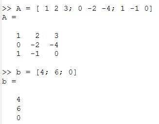
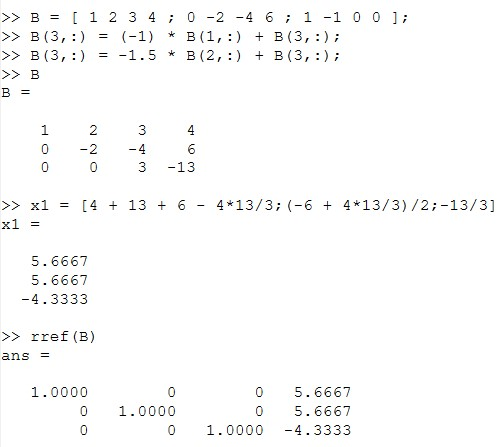
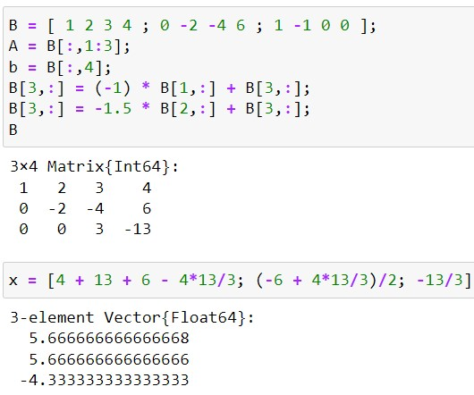
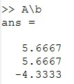
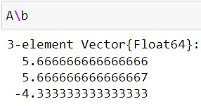
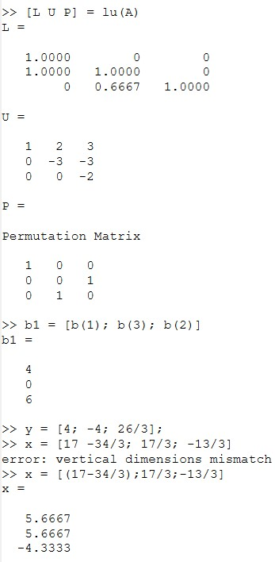
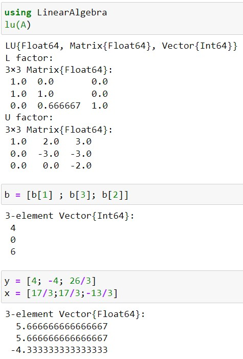
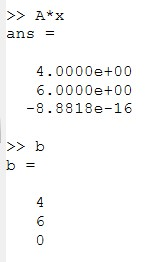
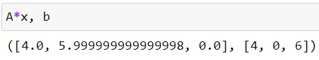

---
## Front matter
lang: ru-RU
title: Презентация по лабораторной работе №4
subtitle: Дисциплина "Научное программирование"
author:
  - Живцова А.А.
institute:
  - Кафедра теории вероятностей и кибербезопасности, Российский университет дружбы народов имени Патриса Лумумбы, Москва, Россия
date: 11 октября 2024

## i18n babel
babel-lang: russian
babel-otherlangs: english

## Formatting pdf
toc: false
toc-title: Содержание
slide_level: 2
aspectratio: 169
section-titles: true
theme: metropolis
header-includes:
 - \metroset{progressbar=frametitle,sectionpage=progressbar,numbering=fraction}
---

# Информация

## Докладчик

:::::::::::::: {.columns align=center}
::: {.column width="70%"}

  * Живцова Анна Александровна
  * студент кафедры теории вероятностей и кибербезопасности
  * Российский университет дружбы народов имени Патриса Лумумбы
  * [zhivtsova_aa@pfur.ru](mailto:zhivtsova_aa@pfur.ru)
  * <https://github.com/AnnaZhiv>

:::
::: {.column width="30%"}


:::
::::::::::::::

# Вводная часть

## Актуальность

Системы линейных уравнений возникают во многих научных задачах. Языки Octave и Julia содержат сложные алгоритмы, встроенные для решения систем линейных уравнений. Наиболее популярные методы: метод Гаусса, обращение матрицы и LU разложение мы рассмотрим сегодня. 

## Объект и предмет исследования

- Системы линейных алгебраических уравнений       
- Метод Гаусса     
- Метод обращения матрицы     
- LU разложение          

## Цели

- Изучить методы решения систем линейных уравнений         
- Реализовать методы программно на языках Octave и Julia     

## Задачи

- Изучить и реализовать метод Гаусса для решения систем линейных уравнений     
- Решить систему линейных уравнений обращением матрицы     
- Изучить и реализовать метод решения систем линейных уравнений, основанный на LU разложении  

## Материалы и методы

- Язык научного программирования Octave    
- Среда программирования GNUoctave   
- Язык научного программирования Julia     
- Среда программирования Jupyter notebook     

# Выполнение работы

## Исходные данные

Будем решать систему линейных уравнений, в матричном виде имеющую запись $Ax = b$. Зададим матрицу $A$ и вектор $b$.

{#fig:001}

## Решение методом Гаусса. Octave

Проведем прямой и обратный ход вручную и сравним результаты с встроенной функцией ```rref```.

{#fig:002}

## Решение методом Гаусса. Julia

{#fig:012}

## Решение обращением матрицы. Octave

Найдем вектор $x$ с помощью операции левого деления ```A\b```.

{#fig:003}

## Решение обращением матрицы. Julia

{#fig:013}

## Решение с помощью LU разложения. Octave

Найдем матрицы L и U с помощью функции ```lu``` и решим исходную систему уравнений дважды реализовав подстановку.

{#fig:004}

## Решение с помощью LU разложения. Julia

{#fig:014}

# Результаты

## Проверка полученных результатов. Octave

Вектор $x$, найденный в этой работе тремя способами, подставим в исходное уравнение и удостоверимся в правильности решения. 

{#fig:005}

## Проверка полученных результатов. Julia

{#fig:015}

# Выводы

В данной работе я познакомилась с методами решения систем линейных уравнений и реализовала их программно на языках Octave и Julia. Конкретно я использовала метод Гаусса для решения систем линейных уравнений, метод обращения матрицы и метод, основанный на LU разложении.


