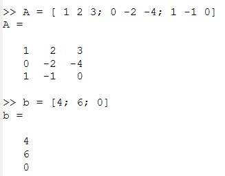
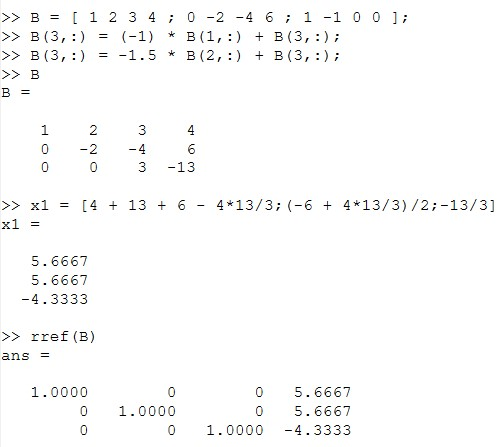
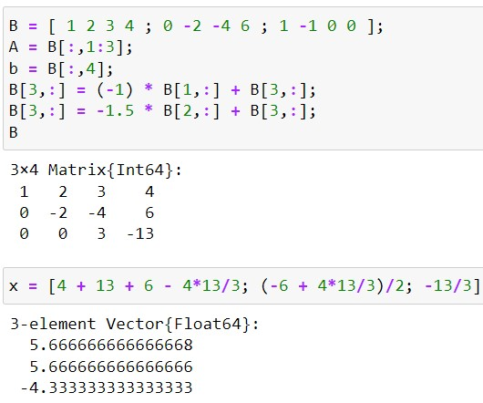
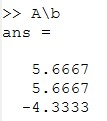
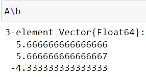
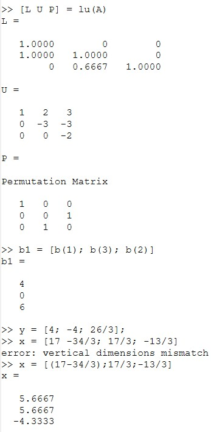
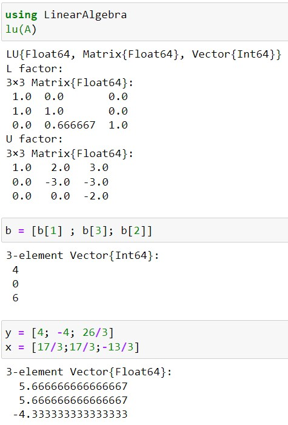

---
## Front matter
title: "Отчёт по лабораторной работе №4"
subtitle: "Дисциплна: Научное программирование"
author: "Живцова Анна, 1132249547"

## Generic otions
lang: ru-RU
toc-title: "Содержание"

## Bibliography
bibliography: cite.bib
csl: pandoc/csl/gost-r-7-0-5-2008-numeric.csl

## Pdf output format
toc: true # Table of contents
toc-depth: 2
lof: true # List of figures
lot: true # List of tables
fontsize: 12pt
linestretch: 1.5
papersize: a4
documentclass: scrreprt
## I18n polyglossia
polyglossia-lang:
  name: russian
  options:
	- spelling=modern
	- babelshorthands=true
polyglossia-otherlangs:
  name: english
## I18n babel
babel-lang: russian
babel-otherlangs: english
## Fonts
mainfont: IBM Plex Serif
romanfont: IBM Plex Serif
sansfont: IBM Plex Sans
monofont: IBM Plex Mono
mathfont: STIX Two Math
mainfontoptions: Ligatures=Common,Ligatures=TeX,Scale=0.94
romanfontoptions: Ligatures=Common,Ligatures=TeX,Scale=0.94
sansfontoptions: Ligatures=Common,Ligatures=TeX,Scale=MatchLowercase,Scale=0.94
monofontoptions: Scale=MatchLowercase,Scale=0.94,FakeStretch=0.9
mathfontoptions:
## Biblatex
biblatex: true
biblio-style: "gost-numeric"
biblatexoptions:
  - parentracker=true
  - backend=biber
  - hyperref=auto
  - language=auto
  - autolang=other*
  - citestyle=gost-numeric
## Pandoc-crossref LaTeX customization
figureTitle: "Рис."
tableTitle: "Таблица"
listingTitle: "Листинг"
lofTitle: "Список иллюстраций"
lotTitle: "Список таблиц"
lolTitle: "Листинги"
## Misc options
indent: true
header-includes:
  - \usepackage{indentfirst}
  - \usepackage{float} # keep figures where there are in the text
  - \floatplacement{figure}{H} # keep figures where there are in the text
---

# Цель работы

- Изучить методы решения систем линейных уравнений         
- Реализовать методы программно на языках Octave и Julia    

# Задание

- Изучить и реализовать метод Гаусса для решения систем линейных уравнений     
- Решить систему линейных уравнений обращением матрицы     
- Изучить и реализовать метод решения систем линейных уравнений, основанный на LU разложении        

# Теоретическое введение

Octave содержит сложные алгоритмы, встроенные для решения систем линейных уравнений [@mymanual]. То же можно сказать и про язык научного программирования Julia [@mymanual2]. Наиболее популярные методы: метод Гаусса, обращение матрицы и LU разложение мы рассмотрим сегодня. 

Метод Гаусса состоит из прямого и обратного хода. В прямом ходе с помощью элементарных операций матрица системы приводится к треугольному виду. В обратном ходе осуществляется прямая подстановка неизвестных.

В методе LU разложения матрица системы представляется в виде произведения матриц L и U, где L — нижняя треугольная матрица, а U — верхняя треугольная матрица. Сначала прямой подстановкой решается уравнение $Ly = b$, а потом обратной подстановкой решается уравнение $Ux = y$. 

# Выполнение лабораторной работы

## Исходные данные

Будем решать систему линейных уравнений, в матричном виде имеющую запись $Ax = b$. Зададим матрицу $A$ и вектор $b$ (см рис. [-@fig:001]).

{#fig:001}

## Решение методом Гаусса

Проведем прямой и обратный ход вручную и сравним результаты с встроенной функцией ```rref``` (см рис. [-@fig:002], [-@fig:012]).

{#fig:002}

{#fig:012}

## Решение обращением матрицы

Найдем вектор $x$ с помощью операции левого деления ```A\b``` (см рис. [-@fig:003], [-@fig:013]).

{#fig:003}

{#fig:013}

## Решение с помощью LU разложения

Найдем матрицы L и U с помощью функции ```lu``` и решим исходную систему уравнений дважды реализовав подстановку (см рис. [-@fig:004], [-@fig:014]).

{#fig:004}

{#fig:014}

# Выводы

В данной работе я познакомилась с методами решения систем линейных уравнений и реализовала их программно на языках Octave и Julia. Конкретно я использовала метод Гаусса для решения систем линейных уравнений, метод обращения матрицы и метод, основанный на LU разложении.

# Список литературы

::: {#refs}
:::
