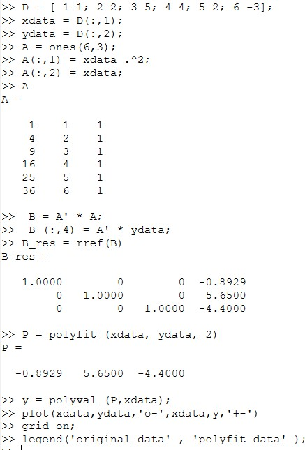
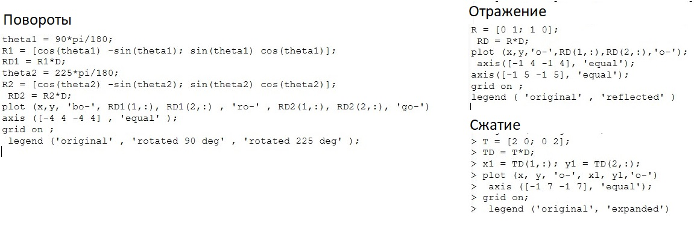
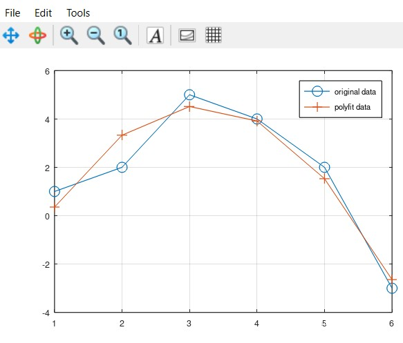
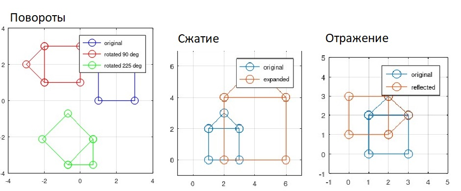

---
## Front matter
lang: ru-RU
title: Презентация по лабораторной работе №5
subtitle: Дисциплина "Научное программирование"
author:
  - Живцова А.А.
institute:
  - Кафедра теории вероятностей и кибербезопасности, Российский университет дружбы народов имени Патриса Лумумбы, Москва, Россия
date: 11 октября 2024

## i18n babel
babel-lang: russian
babel-otherlangs: english

## Formatting pdf
toc: false
toc-title: Содержание
slide_level: 2
aspectratio: 169
section-titles: true
theme: metropolis
header-includes:
 - \metroset{progressbar=frametitle,sectionpage=progressbar,numbering=fraction}
---

# Информация

## Докладчик

:::::::::::::: {.columns align=center}
::: {.column width="70%"}

  * Живцова Анна Александровна
  * студент кафедры теории вероятностей и кибербезопасности
  * Российский университет дружбы народов имени Патриса Лумумбы
  * [zhivtsova_aa@pfur.ru](mailto:zhivtsova_aa@pfur.ru)
  * <https://github.com/AnnaZhiv>

:::
::: {.column width="30%"}


:::
::::::::::::::

# Вводная часть

## Актуальность

Построение полиномиальной регрессии и преобразование плоских изображений -- распространенные задачи в науной деятельности. Octave предоставляет удобный инструментарий для быстрой и автоматизированной реализации этих задач и графического представления результатов. 

## Объект и предмет исследования

- Метод полиномиальной подгонки     
- Метод наименьших кадратов         
- Плоские фигуры        
- Матричные преобразования для операций 
  - вращения     
  - отражения     
  - сжатия            

## Цели

- Изучить и реализовать в Octave метод построения полиномиальной регрессии          
- Изучить и реализовать в Octave методы преобразования изображений      

## Задачи

- Изучить и реализовать метод построения полиномиальной регрессии второго порядка      
- Реализовать построение полиномиальной регрессии второго порядка с помощью встроенной функции Octave
- Изобразить результат регрессии     
- Построиь изобрабражение замкнутой линии     
- Изучить и реализовать с помощью матричных преобразований операции 
  - вращения     
  - отражения     
  - сжатия     
- Изобразить результаты применения данных операций             

## Материалы и методы

- Язык научного программирования Octave     
- Среда программирования GNUoctave     
- Язык научного программирования Julia     
- Среда программирования Jupyter notebook     

# Выполнение работы

## Подгонка полиномиальной кривой

Сначала самостоятельно найдем коэффициенты подгоночой параболы, далее сверим их с теми, что дает встроенная функция ```= polyfit```.

{#fig:001}

## Матричные преобразования

Реализуем два вращения на углы 90 и 225 градусов. Отразим изображение относительно прямой $y = x$. Увеличим изображение в два раза.

{#fig:004}

# Результаты

## Полиномиальная регрессия

{#fig:002}

## Матричные операции

{#fig:004}

# Выводы

В данной работе я познакомилась с методом построения полиномиальной регресси. Изучила и реализовала метод построения полиномиальной регрессии второго порядка с помощью наименьших квадратов. Сравнила результаты с результатами встроенной функции Octave. Изобразила результат регрессии. 

Также я изучила и реализовала в Octave матричные операции для преобразования плоской фигуры. Конкретно, я выполнила операци вращения, отражения и сжатия, а также изобразила результаты применения данных операций.     


