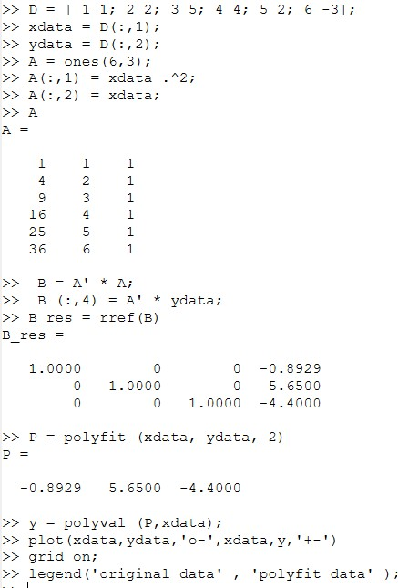
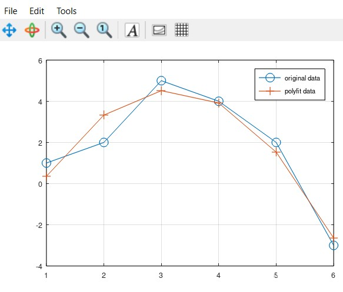
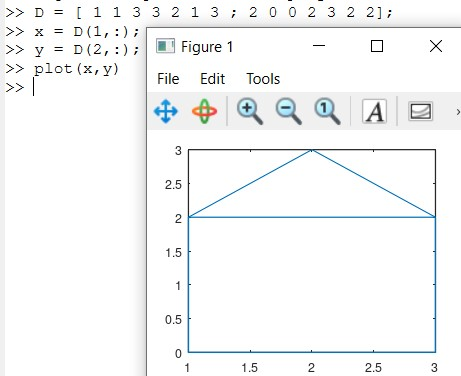
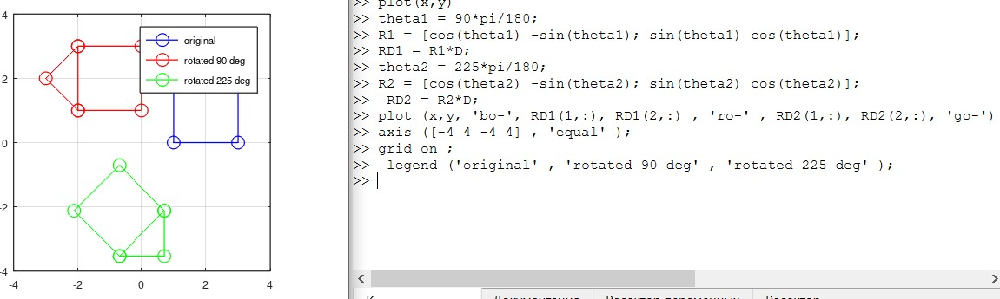
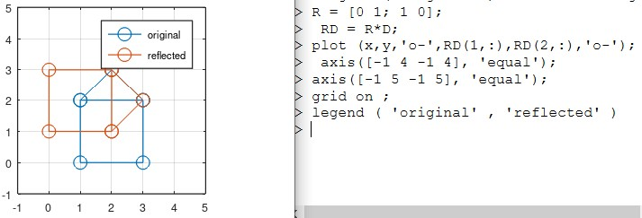
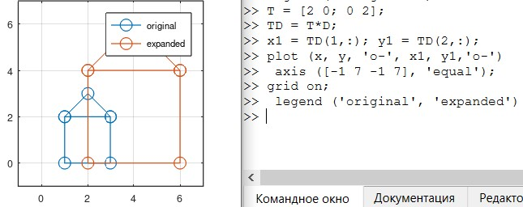

---
## Front matter
title: "Отчёт по лабораторной работе №5"
subtitle: "Дисциплна: Научное программирование"
author: "Живцова Анна, 1132249547"

## Generic otions
lang: ru-RU
toc-title: "Содержание"

## Bibliography
bibliography: cite.bib
csl: pandoc/csl/gost-r-7-0-5-2008-numeric.csl

## Pdf output format
toc: true # Table of contents
toc-depth: 2
lof: true # List of figures
lot: true # List of tables
fontsize: 12pt
linestretch: 1.5
papersize: a4
documentclass: scrreprt
## I18n polyglossia
polyglossia-lang:
  name: russian
  options:
	- spelling=modern
	- babelshorthands=true
polyglossia-otherlangs:
  name: english
## I18n babel
babel-lang: russian
babel-otherlangs: english
## Fonts
mainfont: IBM Plex Serif
romanfont: IBM Plex Serif
sansfont: IBM Plex Sans
monofont: IBM Plex Mono
mathfont: STIX Two Math
mainfontoptions: Ligatures=Common,Ligatures=TeX,Scale=0.94
romanfontoptions: Ligatures=Common,Ligatures=TeX,Scale=0.94
sansfontoptions: Ligatures=Common,Ligatures=TeX,Scale=MatchLowercase,Scale=0.94
monofontoptions: Scale=MatchLowercase,Scale=0.94,FakeStretch=0.9
mathfontoptions:
## Biblatex
biblatex: true
biblio-style: "gost-numeric"
biblatexoptions:
  - parentracker=true
  - backend=biber
  - hyperref=auto
  - language=auto
  - autolang=other*
  - citestyle=gost-numeric
## Pandoc-crossref LaTeX customization
figureTitle: "Рис."
tableTitle: "Таблица"
listingTitle: "Листинг"
lofTitle: "Список иллюстраций"
lotTitle: "Список таблиц"
lolTitle: "Листинги"
## Misc options
indent: true
header-includes:
  - \usepackage{indentfirst}
  - \usepackage{float} # keep figures where there are in the text
  - \floatplacement{figure}{H} # keep figures where there are in the text
---

# Цель работы

- Изучить и реализовать в Octave метод построения полиномиальной регрессии          
- Изучить и реализовать в Octave методы преобразования изображений      

# Задание

- Изучить и реализовать метод построения полиномиальной регрессии второго порядка      
- Реализовать построение полиномиальной регрессии второго порядка с помощью встроенной функции Octave
- Изобразить результат регрессии     
- Построиь изобрабражение замкнутой линии     
- Изучить и реализовать с помощью матричных преобразований операции 
  - вращения     
  - отражения     
  - сжатия     
- Изобразить результаты применения данных операций             

# Теоретическое введение

В статистике часто рассматривается проблема подгонки прямой линии к набору данных. Рассмотрим более общую проблему подгонки полинома к множеству точек. Пусть нам нужно найти параболу по методу наименьших квадратов для набора из $n$ точек, заданных координатами $x_i, \ i = 1, \dots, n$ и $y_i, \ i = 1, \dots, n$. Пусть $A$ -- матрица размерности $n \times 3$, в которой первый столбец состоит из значений $x_i^2$, второй столбец состоит из значений $x_i$ и третий столбец состоит из единиц. Решение по методу наименьших квадратов получается из решения уравнения $A^TA(a;b;c)= A^T(y_1; \dots; y_n)$.

Матрицы и матричные преобразования играют ключевую роль в компьютерной графике. Они позволяют осуществлять операции вращения, отражения и сжатия. Например для поворота точки с координатами $(x, y)$ на угол $\theta$, координаты следует умножить на матрицу 
$$\begin{pmatrix}
cos(\theta) & -sin(\theta) \\
sin(\theta) & cos(\theta)  \\
\end{pmatrix}$$ 
Для отражения относительно прямй, проходящей через начало координат под углом $\theta$, следует умножить координаты точки на матрицу 
$$\begin{pmatrix}
cos(2\theta) & sin(2\theta) \\
sin(2\theta) & -cos(2\theta)  \\
\end{pmatrix}$$ 
Для масштабирования фигуры в $k$ раз, координаты каждой ее точки следует умножить на матрицу 
$$\begin{pmatrix}
k & 0 \\
0 & k  \\
\end{pmatrix}$$

Octave позволяет быстро и эффективно реализовать как метод полиномиальной регрессии, так и матричные операции над точками. Также Octave позволяет изобразить графически полученные результаты [@mymanual].  

# Выполнение лабораторной работы

## Подгонка полиномиальной кривой

Сначала самостоятельно найдем коэффициенты подгоночой параболы, далее сверим их с теми, что дает встроенная функция ```= polyfit``` и изобразим исходе данны и подобранную параболу (см рис. [-@fig:001] и [-@fig:002]).

{#fig:001}

{#fig:002}

## Матричные преобразования

### Исходное изображение

Будем работать с замкнутой ломанной, заданной своими вершинами. Изобразим исходный рисунок, с которым далее будем производить операции (см рис. [-@fig:003]).

{#fig:003}

### Вращение

Реализуем два вращения на углы 90 и 225 градусов (см рис. [-@fig:004]).

{#fig:004}

### Отражение

Отразим изображение относительно прямой $y = x$, т.е. прямой, пересекающей начало координат под углом 45 градусов к оси абсцисс (см рис. [-@fig:005]).

{#fig:005}

### Дилатация

Увеличим изображение в два раза (см рис. [-@fig:006]).

{#fig:006}

# Выводы

В данной работе я познакомилась с методом построения полиномиальной регресси. Изучила и реализовала метод построения полиномиальной регрессии второго порядка с помощью наименьших квадратов. Сравнила результаты с результатами встроенной функции Octave. Изобразила результат регрессии. 

Также я изучила и реализовала в Octave матричные операции для преобразования плоской фигуры. Конкретно, я выполнила операци вращения, отражения и сжатия, а также изобразила результаты применения данных операций.     

# Список литературы

::: {#refs}
:::
