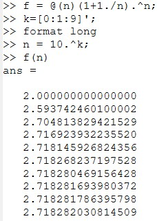
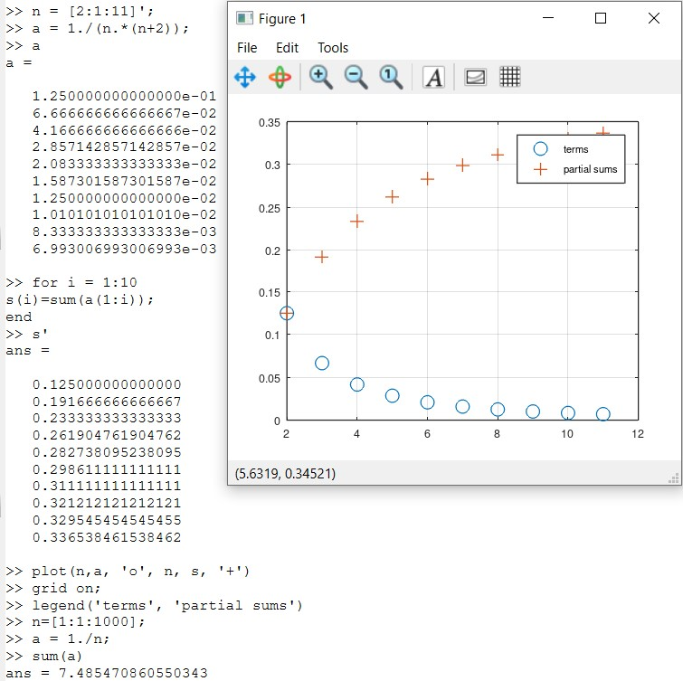
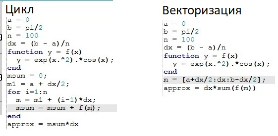
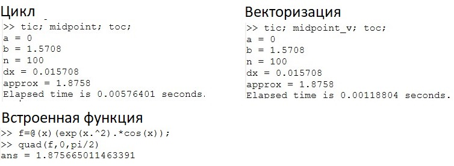

---
## Front matter
lang: ru-RU
title: Презентация по лабораторной работе №6
subtitle: Дисциплина "Научное программирование"
author:
  - Живцова А.А.
institute:
  - Кафедра теории вероятностей и кибербезопасности, Российский университет дружбы народов имени Патриса Лумумбы, Москва, Россия
date: 11 октября 2024

## i18n babel
babel-lang: russian
babel-otherlangs: english

## Formatting pdf
toc: false
toc-title: Содержание
slide_level: 2
aspectratio: 169
section-titles: true
theme: metropolis
header-includes:
 - \metroset{progressbar=frametitle,sectionpage=progressbar,numbering=fraction}
---

# Информация

## Докладчик

:::::::::::::: {.columns align=center}
::: {.column width="70%"}

  * Живцова Анна Александровна
  * студент кафедры теории вероятностей и кибербезопасности
  * Российский университет дружбы народов имени Патриса Лумумбы
  * [zhivtsova_aa@pfur.ru](mailto:zhivtsova_aa@pfur.ru)
  * <https://github.com/AnnaZhiv>

:::
::: {.column width="30%"}

:::
::::::::::::::

# Вводная часть

## Актуальность

Octave -- полноценный язык программирования, поддерживающий множество типов циклов и условных операторов. Однако, поскольку это векторный язык, многие вещи, которые можно было бы сделать с помощью циклов, векторизовать и получить выигрыш в производительности. 

## Объект и предмет исследования

- Задача оценки предела последовательности     
- Задача поиска частичных сумм рядов     
- Задача численного интегрирования      
- Векторизация     
- Octave           

## Цели

Изучить способы использования Octave для задач     
- Оценки предела последовательности     
- Поиска частичных сумм рядов     
- Численного интегрирования           

## Задачи

Используя векторные вычисления Octave, реализовать       
- Оценку предела последовательности     
- Поиск частичных сумм рядов     
- Численное интегрирование             

## Материалы и методы

- Язык научного программирования Octave     
- Среда программирования GNUoctave     
- Язык научного программирования Julia     
- Среда программирования Jupyter notebook     

# Выполнение работы

## Оценка предела последовательности 

Оценим предел последоательности $a_n = \left(1 + \frac{1}{n}\right)^n$ при $n \to \infty.$ 

{#fig:001}

## Частичные суммы

Найдем и изобразим частичные суммы ряда $a_n \frac{1}{n(n + 2)}.$  Дополнительно найдем сумму первых 1000 членов гармонического ряда. Она примерно равна 7.485470860550343.

## Численное интегрирование

Вычисляем интеграл $\int\limits_{0}^{\pi/2}e^x\cos(x)dx$ с помощью двух программ, реализующих метод прямоугольников. 

# Результаты

## Сравнение времени выполнения программ

# Выводы

В данной работе я научилась эффективно использовать Octave для задач оценки предела последовательности, поиска частичных сумм рядов  и численного интегрирования. Также, на примере задачи численного интегрирования, я произвела оценку производительности программы, использующей векторные вычисления, и программы, не использующей векторные вычисления.    

