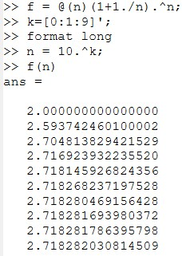
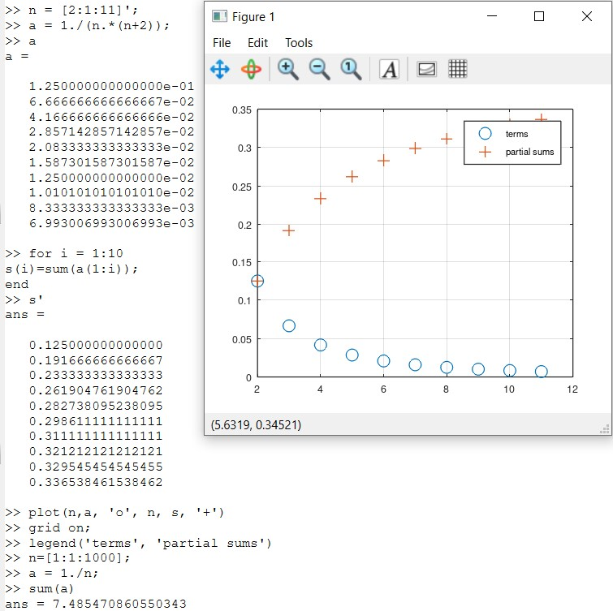
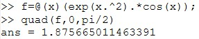
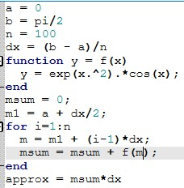
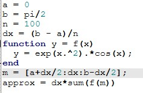
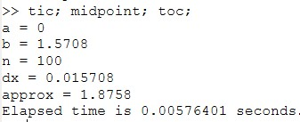
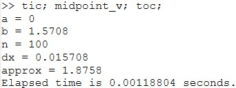

---
## Front matter
title: "Отчёт по лабораторной работе №6"
subtitle: "Дисциплна: Научное программирование"
author: "Живцова Анна, 1132249547"

## Generic otions
lang: ru-RU
toc-title: "Содержание"

## Bibliography
bibliography: cite.bib
csl: pandoc/csl/gost-r-7-0-5-2008-numeric.csl

## Pdf output format
toc: true # Table of contents
toc-depth: 2
lof: true # List of figures
lot: true # List of tables
fontsize: 12pt
linestretch: 1.5
papersize: a4
documentclass: scrreprt
## I18n polyglossia
polyglossia-lang:
  name: russian
  options:
	- spelling=modern
	- babelshorthands=true
polyglossia-otherlangs:
  name: english
## I18n babel
babel-lang: russian
babel-otherlangs: english
## Fonts
mainfont: IBM Plex Serif
romanfont: IBM Plex Serif
sansfont: IBM Plex Sans
monofont: IBM Plex Mono
mathfont: STIX Two Math
mainfontoptions: Ligatures=Common,Ligatures=TeX,Scale=0.94
romanfontoptions: Ligatures=Common,Ligatures=TeX,Scale=0.94
sansfontoptions: Ligatures=Common,Ligatures=TeX,Scale=MatchLowercase,Scale=0.94
monofontoptions: Scale=MatchLowercase,Scale=0.94,FakeStretch=0.9
mathfontoptions:
## Biblatex
biblatex: true
biblio-style: "gost-numeric"
biblatexoptions:
  - parentracker=true
  - backend=biber
  - hyperref=auto
  - language=auto
  - autolang=other*
  - citestyle=gost-numeric
## Pandoc-crossref LaTeX customization
figureTitle: "Рис."
tableTitle: "Таблица"
listingTitle: "Листинг"
lofTitle: "Список иллюстраций"
lotTitle: "Список таблиц"
lolTitle: "Листинги"
## Misc options
indent: true
header-includes:
  - \usepackage{indentfirst}
  - \usepackage{float} # keep figures where there are in the text
  - \floatplacement{figure}{H} # keep figures where there are in the text
---

# Цель работы

Изучить способы использования Octave для задач
- Оценки предела последовательности     
- Поиска частичных сумм рядов     
- Численного интегрирования                

# Задание

Используя векторные вычисления Octave, реализовать       
- Оценку предела последовательности     
- Поиск частичных сумм рядов     
- Численное интегрирование           

# Теоретическое введение

Octave -- полноценный язык программирования, поддерживающий множество типов циклов и условных операторов. Однако, поскольку это векторный язык, многие вещи, которые можно было бы сделать с помощью циклов, векторизовать и получить выигрыш в производительности [@mymanual].  В данной работе мы рассмотрим распространенные численные задачи оценки предела последовательности, нахождения частичных сумм и численного интегрирования. 

# Выполнение лабораторной работы

## Оценка предела последовательности 

Будем оценивать предел последоательности $a_n = \left(1 + \frac{1}{n}\right)^n$ при $n \to \infty.$ Известно, что этот предел равен $e = 2,7182818284$. Найдем значения $a_{n_i}$ при некоторой конечной возрастающей последовательности $n_i$.  (см рис. [-@fig:001]).

{#fig:001}

## Частичные суммы

Рассмотрим ряд, $n$-ый член которого $a_n$ равен $\frac{1}{n(n + 2)}.$ Найдем и изобразим его частичные суммы (см рис. [-@fig:002]). Дополнительно найдем сумму первых 1000 членов гармонического ряда. Она примерно равна 7.485470860550343.

{#fig:002}

## Численное интегрирование

Будем работать с определенным интегралом $\int\limits_{0}^{\pi/2}e^x\cos(x)dx.$ Вычислим его с помощью встроенной функции (см рис. [-@fig:003]), а также с помощью двух программ, реализующих метод прямоугольников (см рис. [-@fig:004] и [-@fig:005]). Сравним производительность программы, использующей векторные вычисления, и программы, не использующей векторные вычисления (см рис. [-@fig:006]
(см рис. [-@fig:007]). 

{#fig:003}

{#fig:004}

{#fig:005}

{#fig:006}

{#fig:007}

# Выводы

В данной работе я научилась эффективно использовать Octave для задач оценки предела последовательности, поиска частичных сумм рядов  и численного интегрирования. Также, на примере задачи численного интегрирования, я произвела оценку производительности программы, использующей векторные вычисления, и программы, не использующей векторные вычисления. 

# Список литературы

::: {#refs}
:::
