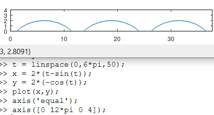
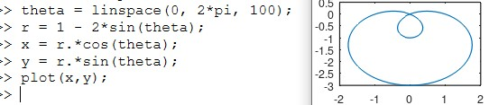
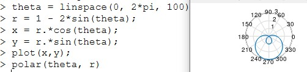
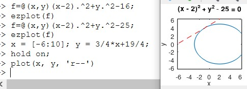
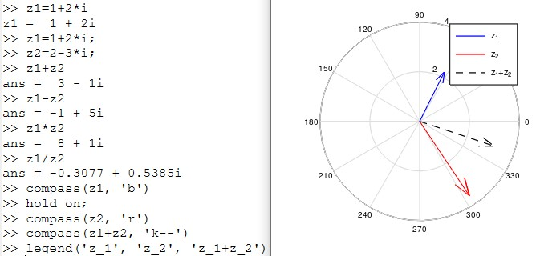
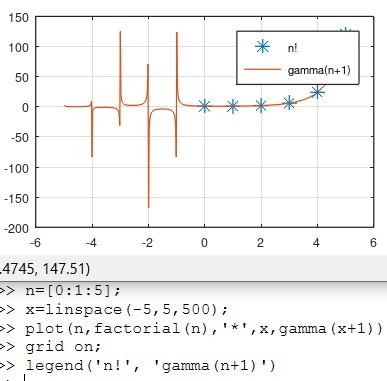

---
## Front matter
lang: ru-RU
title: Презентация по лабораторной работе №7
subtitle: Дисциплина "Научное программирование"
author:
  - Живцова А.А.
institute:
  - Кафедра теории вероятностей и кибербезопасности, Российский университет дружбы народов имени Патриса Лумумбы, Москва, Россия
date: 11 октября 2024

## i18n babel
babel-lang: russian
babel-otherlangs: english

## Formatting pdf
toc: false
toc-title: Содержание
slide_level: 2
aspectratio: 169
section-titles: true
theme: metropolis
header-includes:
 - \metroset{progressbar=frametitle,sectionpage=progressbar,numbering=fraction}
---

# Информация

## Докладчик

:::::::::::::: {.columns align=center}
::: {.column width="70%"}

  * Живцова Анна Александровна
  * студент кафедры теории вероятностей и кибербезопасности
  * Российский университет дружбы народов имени Патриса Лумумбы
  * [zhivtsova_aa@pfur.ru](mailto:zhivtsova_aa@pfur.ru)
  * <https://github.com/AnnaZhiv>

:::
::: {.column width="30%"}

:::
::::::::::::::

# Вводная часть

## Актуальность

Визуализация функций является неотъемлемой частью их исследования. Она упорщает качественный анализ полученных в исследовании функции результатов. Важно уметь визуализировать функции, записанные в различной форме. Универсальным инструментом для визуализации может служить Octave.  

## Объект и предмет исследования

- График параметрических функций     
- График функций, заданных в полярных координатах     
- График неявно заданных функций     
- Изображение комплексных чисел в виде векторов     
- Изображение специальных функций      

## Цели

Изучить способы использования Octave для построения графиков функция, заданных различными способами.    

## Задачи

Используя Octave построить графики       
- Параметрических функций     
- Функций, заданных в полярных координатах     
- Неявно заданных функций     
- Комплексных чисел в виде векторов     
- Специальных функций      

## Материалы и методы

- Язык научного программирования Octave     
- Среда программирования GNUoctave     
- Язык научного программирования Julia     
- Среда программирования Jupyter notebook     

# Выполнение работы

## Параметрические функции    

{#fig:001}

## Функции, заданные в полярных координатах

{#fig:002}

{#fig:003}

## Неявно заданные функции

{#fig:005}

## Комплексные числа в виде векторов          

{#fig:006}

## Специальные функции   

{#fig:007}

# Выводы

В данной работе я научилась эффективно использовать Octave для построения графиков параметрических функций, функций, заданных в полярных координатах, неявно заданных функций, специальных функций и комплексных чисел в виде векторов.        

