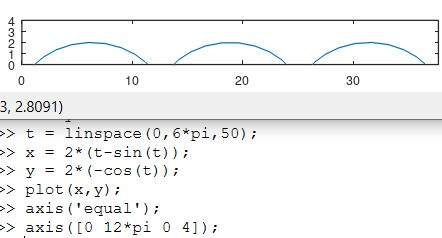
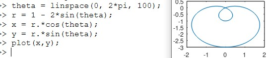
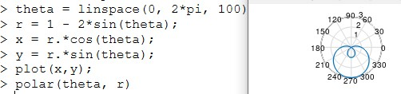
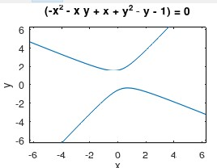
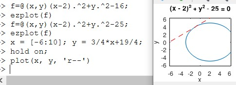
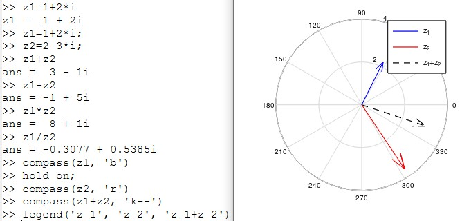
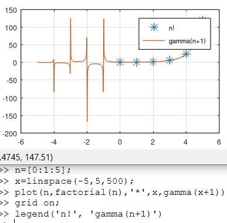
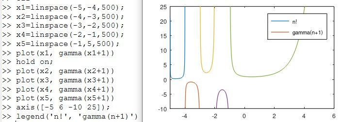

---
## Front matter
title: "Отчёт по лабораторной работе №7"
subtitle: "Дисциплна: Научное программирование"
author: "Живцова Анна, 1132249547"

## Generic otions
lang: ru-RU
toc-title: "Содержание"

## Bibliography
bibliography: cite.bib
csl: pandoc/csl/gost-r-7-0-5-2008-numeric.csl

## Pdf output format
toc: true # Table of contents
toc-depth: 2
lof: true # List of figures
lot: true # List of tables
fontsize: 12pt
linestretch: 1.5
papersize: a4
documentclass: scrreprt
## I18n polyglossia
polyglossia-lang:
  name: russian
  options:
	- spelling=modern
	- babelshorthands=true
polyglossia-otherlangs:
  name: english
## I18n babel
babel-lang: russian
babel-otherlangs: english
## Fonts
mainfont: IBM Plex Serif
romanfont: IBM Plex Serif
sansfont: IBM Plex Sans
monofont: IBM Plex Mono
mathfont: STIX Two Math
mainfontoptions: Ligatures=Common,Ligatures=TeX,Scale=0.94
romanfontoptions: Ligatures=Common,Ligatures=TeX,Scale=0.94
sansfontoptions: Ligatures=Common,Ligatures=TeX,Scale=MatchLowercase,Scale=0.94
monofontoptions: Scale=MatchLowercase,Scale=0.94,FakeStretch=0.9
mathfontoptions:
## Biblatex
biblatex: true
biblio-style: "gost-numeric"
biblatexoptions:
  - parentracker=true
  - backend=biber
  - hyperref=auto
  - language=auto
  - autolang=other*
  - citestyle=gost-numeric
## Pandoc-crossref LaTeX customization
figureTitle: "Рис."
tableTitle: "Таблица"
listingTitle: "Листинг"
lofTitle: "Список иллюстраций"
lotTitle: "Список таблиц"
lolTitle: "Листинги"
## Misc options
indent: true
header-includes:
  - \usepackage{indentfirst}
  - \usepackage{float} # keep figures where there are in the text
  - \floatplacement{figure}{H} # keep figures where there are in the text
---

# Цель работы

Изучить способы использования Octave для построения графиков
- Параметрических функций     
- Функций, заданных в полярных координатах     
- Неявно заданных функций     
- Комплексных чисел в виде векторов          
- Специальных функций                

# Задание

Используя Octave построить графики       
- Параметрических функций     
- Функций, заданных в полярных координатах     
- Неявно заданных функций     
- Комплексных чисел в виде векторов     
- Специальных функций                

# Теоретическое введение

Octave предоставляет возможность для отрисовки широкого класса функций [@mymanual]. В данной работе мы рассмотрим 
- Функцию циклоиды, заданную параметрическим уравнением 
$$\begin{cases} 
x(t) = r(t - \sin(t)) \\
y(t) = r(1 - \cos(t)) \\
\end{cases}$$       
- Функцию улитки Паскаля, заданную в полярных координатах уравеннием     
$$r = 1 - 2\sin(\phi)$$     
- Функцию окружности, заданную неявно уравнением $$(x - 2)^2 + y^2 = 25$$    
- Комплексных чисел в виде векторов в комплексной плоскости     
- Гамма функцию, определяемую уравнением $$\Gamma(x) = \int\limits_{0}^{\infty}t^{x-1}e^{-t}dt.$$                 

# Выполнение лабораторной работы

## Параметрические функции    

Изобразим график двух витков циклоиды радиуса 2 с помощью Octave (см рис. [-@fig:001]).

{#fig:001}

## Функции, заданные в полярных координатах

Изобразим улитку Паскаля в помощью Octave с помощью преобразования к декартовым координатам (см рис. [-@fig:002]) и с помощью использования встроенной функции ``` polar``` вместо ``` plot```.

{#fig:002}

{#fig:003}

## Неявно заданные функции

Используя встроенную функцию ```ezplot```, изобразим график неявной функции, которую определим как анонимную с помощью следующего кода 
```
>> f=@(x,y)(-x.^2-x.*y+x+y.^2-y-1);
>> ezplot(f).
```

{#fig:004}

Далее с помощью этой функции изобразим окружность (см рис. [-@fig:005]) и добавим на график касательные.

{#fig:005}

## Комплексные числа в виде векторов          

Изобразим с помощью Octave вектора, соответствующие двум комплексным числам, и вектор, соответствующий их сумме (см рис. [-@fig:006]).

{#fig:006}

## Специальные функции   

Изобразим Гамма функцию и функцию факториала с помощью Octave (см рис. [-@fig:007]). А также построим Гамма функцию по отдельности на разных отрезках для получения детального вида (см рис. [-@fig:008]).

{#fig:007}

{#fig:008}

# Выводы

В данной работе я научилась эффективно использовать Octave для построения графиков параметрических функций, функций, заданных в полярных координатах, неявно заданных функций, специальных функций и комплексных чисел в виде векторов.                  

# Список литературы

::: {#refs}
:::
