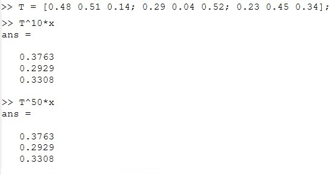

---
## Front matter
lang: ru-RU
title: Презентация по лабораторной работе №8
subtitle: Дисциплина "Научное программирование"
author:
  - Живцова А.А.
institute:
  - Кафедра теории вероятностей и кибербезопасности, Российский университет дружбы народов имени Патриса Лумумбы, Москва, Россия
date: 11 октября 2024

## i18n babel
babel-lang: russian
babel-otherlangs: english

## Formatting pdf
toc: false
toc-title: Содержание
slide_level: 2
aspectratio: 169
section-titles: true
theme: metropolis
header-includes:
 - \metroset{progressbar=frametitle,sectionpage=progressbar,numbering=fraction}
---

# Информация

## Докладчик

:::::::::::::: {.columns align=center}
::: {.column width="70%"}

  * Живцова Анна Александровна
  * студент кафедры теории вероятностей и кибербезопасности
  * Российский университет дружбы народов имени Патриса Лумумбы
  * [zhivtsova_aa@pfur.ru](mailto:zhivtsova_aa@pfur.ru)
  * <https://github.com/AnnaZhiv>

:::
::: {.column width="30%"}

:::
::::::::::::::

# Вводная часть

## Актуальность

Задача поиска собственных значений и собственных векторов матрицы -- распространенная математическая задача, возникающая, например, при определении стационарного распределения пребывания в состояниях конечной цепи Маркова. Octave содержит встроенную функцию для нахождения обственных значений и собственных векторов матрицы.

## Объект и предмет исследования

- Собственные значения и собственные вектора матрицы    
- Конечные цепи Маркова    
- Распределение вероятностей пребывания в состояниях в цепи Маркова            

## Цели

Изучить функцию нахождения собственных значений матрицы в Octave.       

## Задачи

В заданной конечной цепи Маркова     
- Найти распределение вероятностей прребывания в состояниях за $n$ шагов     
- Найти стационарное распределение с помощью собственных векторов матрицы переходных вероятностей        

## Материалы и методы

- Язык научного программирования Octave     
- Среда программирования GNUoctave     
- Язык научного программирования Julia     
- Среда программирования Jupyter notebook     

# Выполнение работы

## Распределение вероятностей пребывания в состояниях для цепи Маркова

Определим цепь Маркова и найдем распределение вероятностей пребывания в состояниях через $n=5$ шагов для различных начальных распределений. 

{#fig:002}

## Стационарное распределение через собственный вектор

Найдем стационарное распределение через собственный вектор, соответствующий собственному значению 1, матрицы переходных вероятностей. 

{#fig:003}

# Результаты

## Проверка стационарности найденного распределения     

# Выводы

В данной работе я изучила функцию поиска собственных значений и векторов матрицы, а также использовала эту функцию для нахождения стационарного распределения вероятностей пребывания в состояниях конечной цепи Маркова. Дополнительно, пользуясь определением, я нашла распределение вероятностей пребывания в состояниях за $n$ шагов.  

