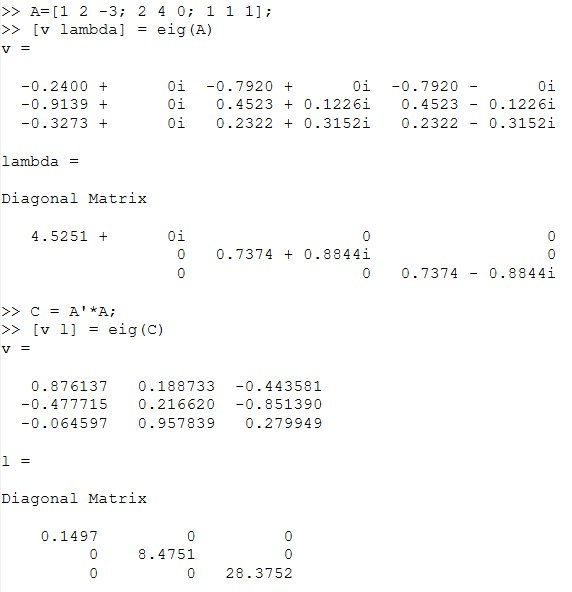
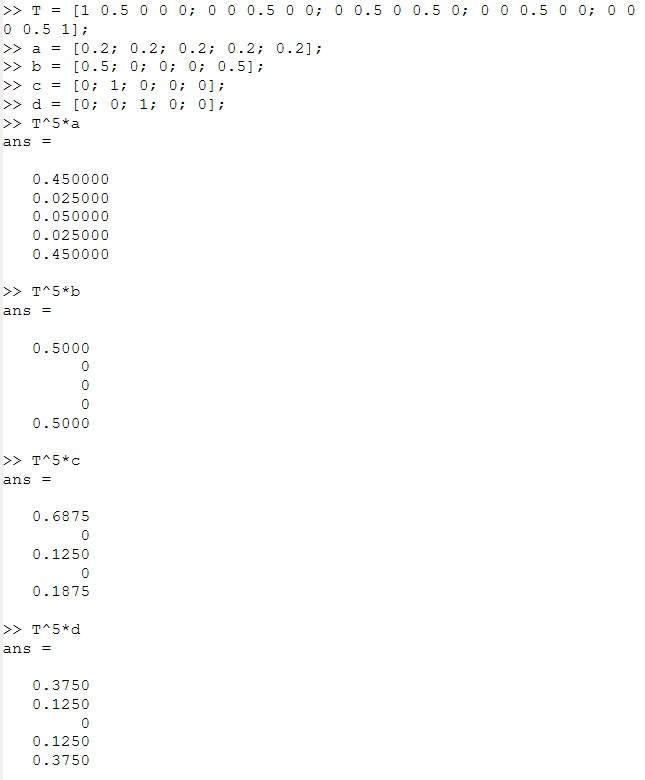
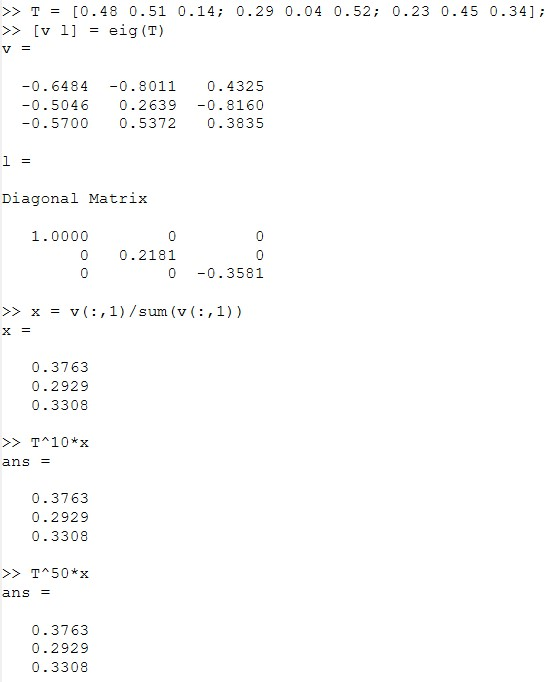

---
## Front matter
title: "Отчёт по лабораторной работе №8"
subtitle: "Дисциплна: Научное программирование"
author: "Живцова Анна, 1132249547"

## Generic otions
lang: ru-RU
toc-title: "Содержание"

## Bibliography
bibliography: cite.bib
csl: pandoc/csl/gost-r-7-0-5-2008-numeric.csl

## Pdf output format
toc: true # Table of contents
toc-depth: 2
lof: true # List of figures
lot: true # List of tables
fontsize: 12pt
linestretch: 1.5
papersize: a4
documentclass: scrreprt
## I18n polyglossia
polyglossia-lang:
  name: russian
  options:
	- spelling=modern
	- babelshorthands=true
polyglossia-otherlangs:
  name: english
## I18n babel
babel-lang: russian
babel-otherlangs: english
## Fonts
mainfont: IBM Plex Serif
romanfont: IBM Plex Serif
sansfont: IBM Plex Sans
monofont: IBM Plex Mono
mathfont: STIX Two Math
mainfontoptions: Ligatures=Common,Ligatures=TeX,Scale=0.94
romanfontoptions: Ligatures=Common,Ligatures=TeX,Scale=0.94
sansfontoptions: Ligatures=Common,Ligatures=TeX,Scale=MatchLowercase,Scale=0.94
monofontoptions: Scale=MatchLowercase,Scale=0.94,FakeStretch=0.9
mathfontoptions:
## Biblatex
biblatex: true
biblio-style: "gost-numeric"
biblatexoptions:
  - parentracker=true
  - backend=biber
  - hyperref=auto
  - language=auto
  - autolang=other*
  - citestyle=gost-numeric
## Pandoc-crossref LaTeX customization
figureTitle: "Рис."
tableTitle: "Таблица"
listingTitle: "Листинг"
lofTitle: "Список иллюстраций"
lotTitle: "Список таблиц"
lolTitle: "Листинги"
## Misc options
indent: true
header-includes:
  - \usepackage{indentfirst}
  - \usepackage{float} # keep figures where there are in the text
  - \floatplacement{figure}{H} # keep figures where there are in the text
---

# Цель работы

Изучить функцию нахождения собственных значений матрицы в Octave.           

# Задание

В заданной конечной цепи Маркова     
- Найти распределение вероятностей прребывания в состояниях за $n$ шагов     
- Найти стационарное распределение с помощью собственных векторов матрицы переходных вероятностей        

# Теоретическое введение

Конечные цепи Маркова определяются матрицей переходных вероятностей $P$ и начальным распределением $a$. Распределение вероятностей пребывания в состояниях за $n$ шагов можно найти по формуле $aP^n$. Конечная цепь маркова имеет стационарное распределение вероятностей пребывания в состояниях, т.е. такое распределение $x$ что $x = xP.$ Так как это определение собственного вектора, соответствующего собственному значению 1, можем найти стационарное распределение через собственный вектор.

Octave содержит функцию для нахождения собственных значений и собственных векторов [@mymanual]. 

# Выполнение лабораторной работы

## Функция поиска собственных значений и векторов 

Встроенная функция ```eig``` выводит список собственных значений и собственных векторов матрицы (см рис. [-@fig:001]).

{#fig:001}

## Распределение вероятностей пребывания в состояниях для цепи Маркова

Определим цепь Маркова и найдем распределение вероятностей пребывания в состояниях через $n=5$ шагов для различных начальных распределений (см рис. [-@fig:002]). 

{#fig:002}

## Стационарное распределение через собственный вектор

Найдем стационарное распределение через собственный вектор, соответствующий собственному значению 1, матрицы переходных вероятностей (см рис. [-@fig:003]). 

{#fig:003}

# Выводы

В данной работе я изучила функцию поиска собственных значений и векторов матрицы, а также использовала эту функцию для нахождения стационарного распределения вероятностей пребывания в состояниях конечной цепи Маркова. Дополнительно, пользуясь определением, я нашла распределение вероятностей пребывания в состояниях за $n$ шагов.  

# Список литературы

::: {#refs}
:::
